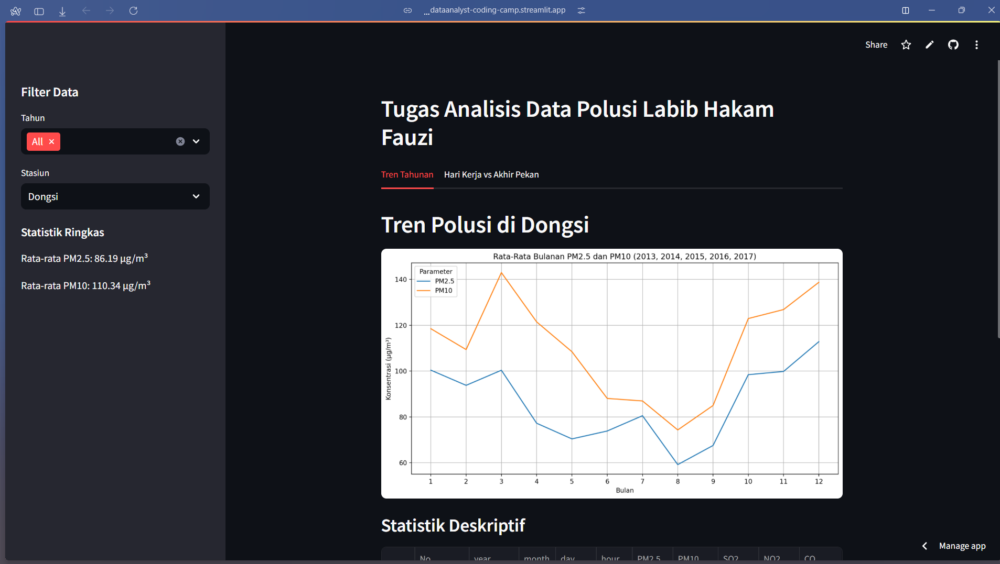
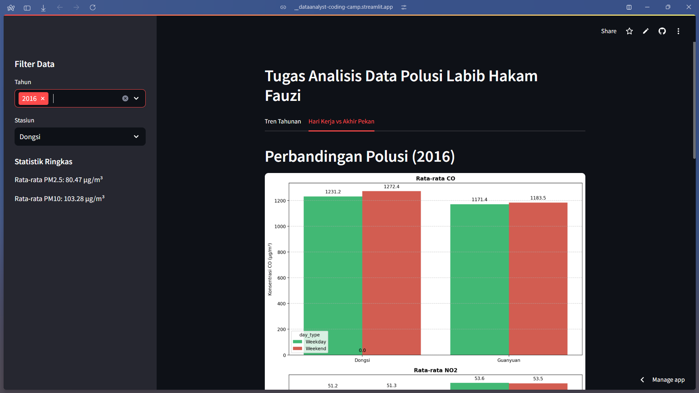
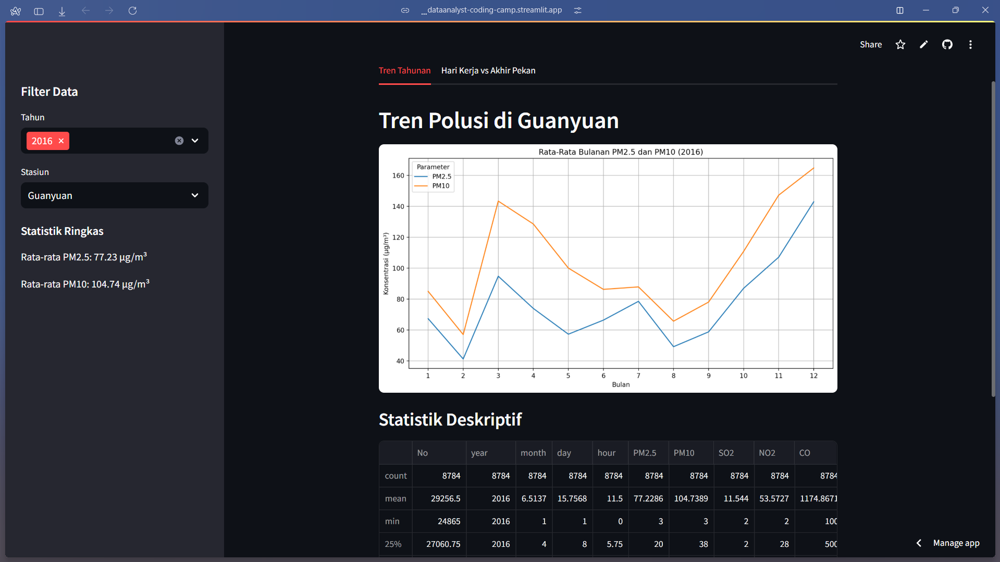
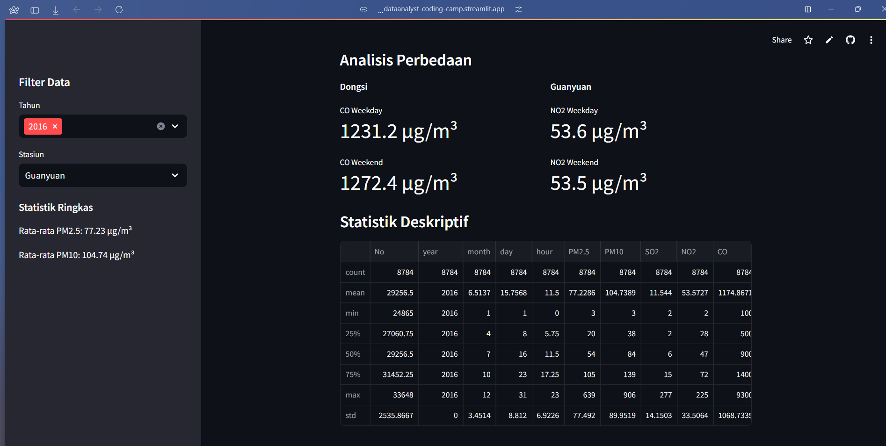

# Data Analyst-Coding Camp
----------------

* **Nama Project**: Data Analyst-Coding Camp
* **Deskripsi Singkat**: Project ini adalah untuk memenuhi assignment dari progam Coding camp pada course data analyst dengan Python

## Tentang Project
-----------------

* **Tujuan Project**: Tujuan utama dari project ini adalah untuk membuat aplikasi web yang dapat membantu menganalisis data polusi udara di Beijing, China.
* **Fitur Utama**:
 + Menganalisis data polusi udara di Beijing, China
 + Menampilkan data polusi udara dalam bentuk grafik dan tabel
 + Memungkinkan pengguna untuk memfilter data berdasarkan tahun dan stasiun
* **Teknologi yang Digunakan**:
 + Python
 + Streamlit
 + Pandas
 + NumPy
 + Matplotlib
 + Seaborn

## Cara Menggunakan
------------------

* **Instalasi**:
 + Clone repository ini ke komputer Anda
 + Jalankan perintah `pip install -r requirements.txt` untuk menginstal dependensi
* **Konfigurasi**:
 + Buat file `.env` dan isi dengan variabel lingkungan yang diperlukan
 + Jalankan perintah `streamlit run dashboard.py` untuk menjalankan aplikasi
* **Penggunaan**:
 + Buka aplikasi di browser Anda
 + Pilih tahun dan stasiun yang ingin dianalisis
 + Lihat hasil analisis data polusi udara dalam bentuk grafik dan tabel

## Fitur
--------

* **Fitur 1**: Menganalisis data polusi udara di Beijing, China
* **Fitur 2**: Menampilkan data polusi udara dalam bentuk grafik dan tabel
* **Fitur 3**: Memungkinkan pengguna untuk memfilter data berdasarkan tahun dan stasiun

## Kontribusi
-------------

* **Cara Berkontribusi**:
 + Fork repository ini ke akun GitHub Anda
 + Buat branch baru dan lakukan perubahan yang diperlukan
 + Buat pull request ke repository ini
* **Daftar Kontributor**: Hakam Fauzi

## Kontak
---------

* **Nama**: Hakam Fauzi
* **Email**: [labibhakam.fauzi@gmail.com](mailto:labibhakam.fauzi@gmail.com)
* **github**: [https://github.com/hakamfauzi](https://github.com/hakamfauzi)

## Terima Kasih
--------------

* **Terima kasih kepada**: Marcelo Reis untuk data polusi udara di Beijing, China.

## Screenshots
-------------

* 
* 
* 
* 